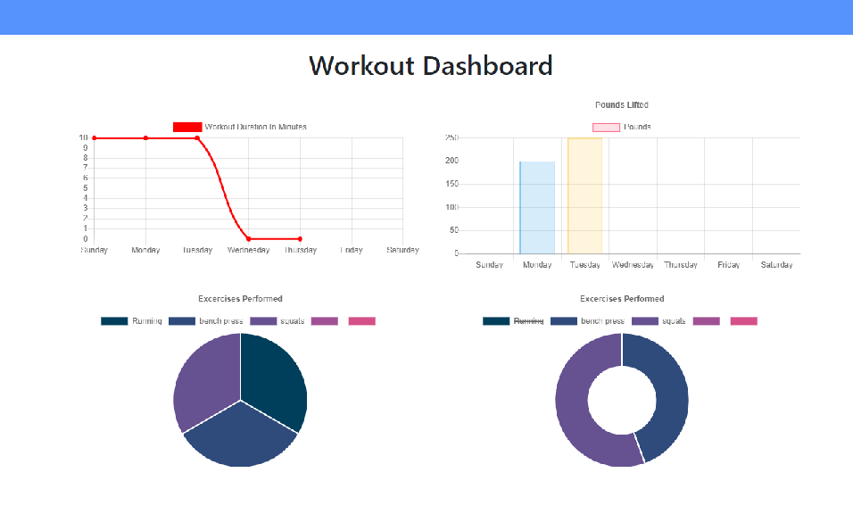

# Fitness Tracker

## Deployed Site:
https://group1-simple-resume.herokuapp.com/

---

## Description

`PROJECT DESCRIPTION:` The fitness tracker is an application that allows the user to record his/her exercises in a workout session and have it stored in a mongoDB database, and view the stats from the workout.  As well as add new workouts and keep track of the past 7 days of exersizes.   

`WHO IS IT FOR?:` this app is for someone looking for a simple and easy way to keep track of his or her workout routine.  The distance ran, the duration of the workout, the weights lifted with how many sets and reps.

  ---

## Table of Contents

  - [Deployed Site](#deployed-site)
  - [Description](#description)
  - [Usage](#usage)
  - [Directory Structure](#directory-structure)
  - [Questions](#questions)
 
 ---

## Usage
  *Instructions and examples for use:*

To run this application:
1. Visit the deployed link above

2. create a new workout, with as many exersizes as you would like.

3. view the dashboard for your stats
5. and enjoy
---

## Questions?

  If you have any questions you can check out my github account: [Rseckman](https://github.com/Rseckman)
  or contact me at rseckman@hotmail.com

---